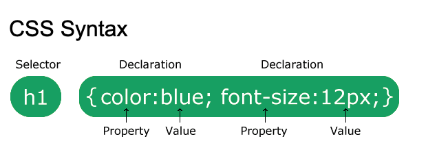

# Lesson 3: CSS

## Warmup

If you haven't already, 

1. Create the following files in your project directory: 
    * `about.html` 
    * `blog.html`   
    * `contact.html`

1. Create a bulleted list of links at the top of each page that you just created
    * Home 
    * About 
    * Blog 
    * Contact 

1. Add the following text in a `<p>` tag to each page:

  > This website was made by {your name}. The source code can be found [here](https://github.com)


## CSS Basics 

You can add CSS to an HTML element in 3 ways: 

1. In-line 

  ```html
  <p style="color: red; text-align: center;"> Yo what is up look at my red text </p>
  ```

Here is a link for styling text: https://developer.mozilla.org/en-US/docs/Learn/CSS/Styling_text/Fundamentals

**DO NOW**: Edit a paragraph in your website with some inline style. 

2. In a `<style>` tag 

  ```html
  <html>
    <head>
      <style>
        h1 {color:red;}
        p {color:blue;}
      </style>
    </head>
    <body>

      <h1>A heading</h1>
      <p>A paragraph.</p>

    </body>
  </html> 
  ```

**DO NOW**: Edit a the `index.html` in your website to include a style block. 

3. In the `style.css` file 

  ```css
    html, body {
    margin: 0;
    padding: 0;
    }

    body {
      font-family: 'Roboto', sans-serif;
      font-weight: 100;
    }

    .container {
      margin: 0 auto;
      max-width: 940px; 
      padding: 0 10px;
    }

    .header {
      background: url(https://content.codecademy.com/projects/innovation-cloud/bg.jpg) no-repeat center center; 
      background-size: cover;
      height: 800px;
      text-align: center; 
    }

    .header .container {
      position: relative;
      top: 200px;
    }

    .header h1 {
      color: #fff;
      line-height: 100px; 
      font-size: 80px;
      margin-top: 0;
      margin-bottom: 80px;
      text-transform: uppercase; 
    }
  ```

The best practice is option #3. This makes it easier to read html files, and allows for maximum re-usability of our custom styles. 

## CSS Terminology 



1. The **Selector** is the first part of a CSS ruleset. This targets the HTML element that will be styled. 
1. The **Declaration Block** is everything inside the two brackets {}. There can be multiple declarations inside a declaration block
1. A **Declaration** is a `property-value` pair that will apply to the _selected_ element. 
1. The **Property** is the first part of each declaration. It describes the visual characteristic of the element to be modified. 
1. The **Value** is the second part of each declaration. It describes what the property of the element should look like. 

## HTML Div tags 

The `<div>` tag is the most common way web designers _divide_ their HTML elements. We can give each div a different **class**, and style the classes accordingly. 


### Creating a Navbar 

** DO NOW **: On every page, edit the list of links so it looks like this 

```html 
<div class="nav">
  <div class="container">
    <ul>
        <li> <a href="index.html"> Home </a> </li>
        <li> <a href="about.html"> About </a> </li>
        <li> <a href="blog.html"> Blog </a>
        <li> <a href="contact.html"> Contact </a> </li>
      </ul>
  </div>
</div>
```

Now, add the following code to your css file, one at a time. 

```css

.container {
  margin: 0 auto;
  max-width: 940px; 
  padding: 0 10px;
}

.nav { 
  background: #000;
  height: 80px; 
  width: 100%;
}

.nav ul {
  height: 80px;
  list-style: none;
  margin: 0 auto; 
  padding: 0;
}

.nav ul li {
  color: #fff;
  display: inline-block; 
  height: 80px;
  line-height: 80px; 
  list-style: none;
  padding: 0 10px;
  transition: background .5s; 
}

nav ul li:hover {
  background: #117bff;
  cursor: pointer; 
  transition: background .5s;  
}

```

### Creating a Footer 

** DO NOW **: On every page, edit the bottom paragraph so it looks like this: 

```html 
    <div class="footer">
      <div class="container">
        <p>This website was made by {your name}. The source code can be found here</p>
      </div>
    </div>
```


Add the following CSS to your file, one declaration block at a time:

```css
.footer { 
  background: #000;
  height: 80px; 
  padding-bottom: 50px;
}

.footer p { 
  color: #fff;
  font-size: 14px;  
  height: 80px; 
  line-height: 80px;
  margin: 0;  
}
```

### Creating a Jumbotron
First add the following HTML 

```html 
    <div class="jumbotron">
        <div class="container">
          <h2>Stay Connected</h2>
        </div>
    </div>  
```

Then add the following CSS, one at a time

```css
.jumbotron {
  background: url(https://content.codecademy.com/projects/innovation-cloud/jumbotron_bg.jpg) center center;
  background-size: cover;
  height: 600px; 
}

.jumbotron .container {
  position: relative;
  top: 220px;
}
```